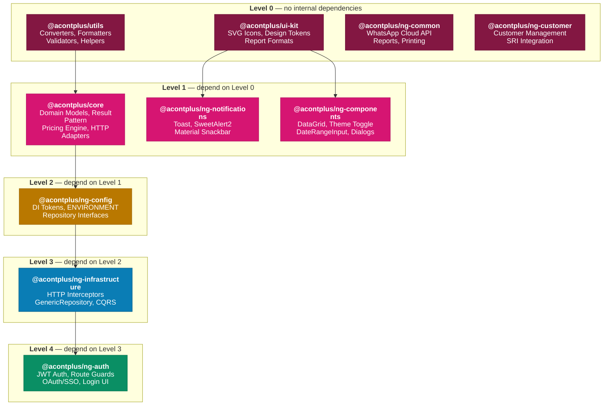
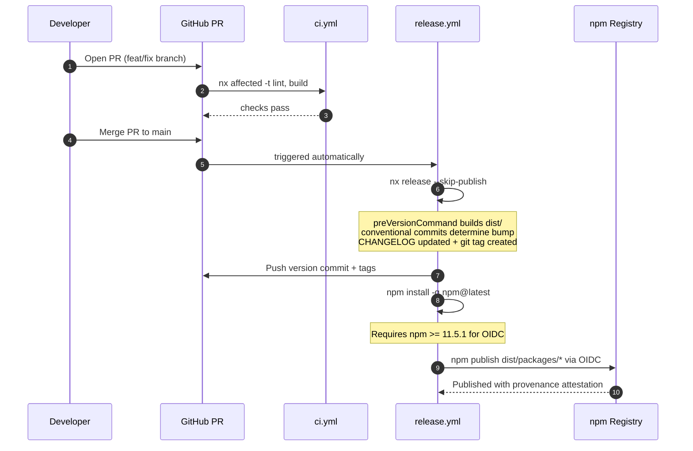
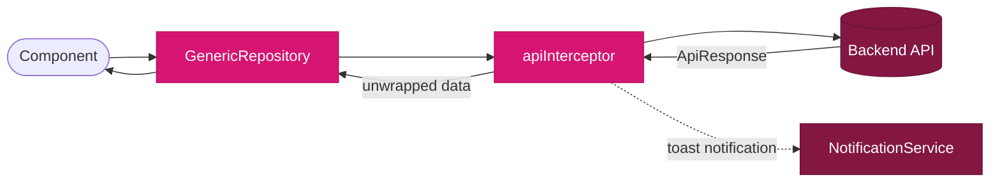

# Architecture

## Color Palette

All diagrams use the Acontplus brand palette:

| Role                      | Color                      | Hex       |
| ------------------------- | -------------------------- | --------- |
| Level 0 — Foundation      | Maroon (brand dark)        | `#831742` |
| Level 1 — Core dependents | Magenta (brand primary)    | `#d61572` |
| Level 2 — Config layer    | Amber (brand accent)       | `#b97800` |
| Level 3 — Infrastructure  | Sky blue (brand secondary) | `#0a7db5` |
| Level 4 — Auth / feature  | Brand green                | `#0a8f64` |

---

## Package Dependency Map

How the 10 npm packages depend on each other — built from actual `peerDependencies` in `package.json` files.

### Key observations

- **`utils` and `ui-kit`** are fully framework-agnostic — zero Angular dependencies. Safe to use in React, Vue, Node, or any JS/TS project.
- **`ng-common` and `ng-customer`** are standalone Angular packages — no internal `@acontplus` peer dependencies, independently upgradable.
- **`ng-auth`** is the deepest dependent — transitively pulls `core → ng-config → ng-infrastructure`. When `core` bumps, the cascade reaches `ng-auth` last.
- **Never install both `ng-infrastructure` and wire repositories manually** — the infrastructure layer handles all interceptor and repository registration.

---

## Release Groups (Nx Independent Versioning)

Packages are organized into three release groups in `nx.json`. Each group is versioned independently — a commit to `utils` does not force a release of `ng-auth`.

| Group            | Packages                                                                                 | Strategy           |
| ---------------- | ---------------------------------------------------------------------------------------- | ------------------ |
| **foundation**   | `utils`, `ui-kit`                                                                        | Versioned together |
| **angular-libs** | `core`, `ng-config`, `ng-notifications`, `ng-components`, `ng-infrastructure`, `ng-auth` | Independent        |
| **standalone**   | `ng-common`, `ng-customer`                                                               | Independent        |

---

## CI/CD Pipeline

---

## HTTP Request/Response Flow

How `@acontplus/ng-infrastructure` standardizes all API responses automatically.

All HTTP responses are automatically transformed to `ApiResponse<T>`. Use `SKIP_NOTIFICATION` HttpContext token to suppress toasts for silent operations. See [[API-Response-Handling]].
