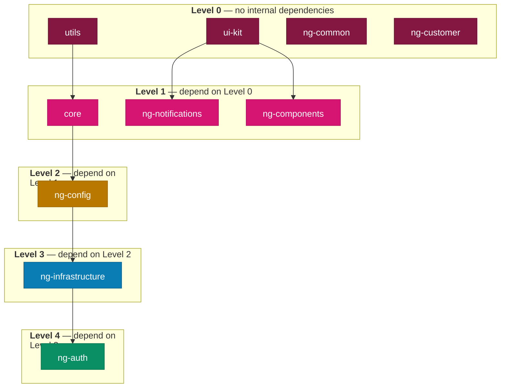

# Acontplus Angular Libraries

Welcome to the documentation wiki for the **Acontplus Angular Libraries** monorepo — 10 npm packages for Angular 22, following Clean Architecture and DDD patterns.

> **Repository**: [acontplus/acontplus-libs](https://github.com/acontplus/acontplus-libs)

---

## 📦 Package Documentation

| Package                                                                                                            | Description                                                                                                                                        |
| ------------------------------------------------------------------------------------------------------------------ | -------------------------------------------------------------------------------------------------------------------------------------------------- |
| [`@acontplus/utils`](https://github.com/acontplus/acontplus-libs/tree/main/packages/utils)                         | Converters (color, decimal, JSON), formatters (date, number, string), validators, helpers — TypeScript/framework-agnostic                          |
| [`@acontplus/ui-kit`](https://github.com/acontplus/acontplus-libs/tree/main/packages/ui-kit)                       | Framework-agnostic SVG icon library (40+ icons incl. social), design tokens, button types, `REPORT_FORMAT` enum                                    |
| [`@acontplus/core`](https://github.com/acontplus/acontplus-libs/tree/main/packages/core)                           | Domain models, pricing engine (discount/tax/profit), HTTP adapters (Axios/Fetch), value objects, use cases, clean architecture                     |
| [`@acontplus/ng-config`](https://github.com/acontplus/acontplus-libs/tree/main/packages/ng-config)                 | Angular DI tokens (`ENVIRONMENT`, `CORE_CONFIG`, `AUTH_TOKEN`), `BaseRepository` interface, auth token repository contract                         |
| [`@acontplus/ng-infrastructure`](https://github.com/acontplus/acontplus-libs/tree/main/packages/ng-infrastructure) | HTTP interceptors (api, spinner, httpContext), `GenericRepository`, `BaseHttpRepository`, `RepositoryFactory`, CQRS, correlation service           |
| [`@acontplus/ng-auth`](https://github.com/acontplus/acontplus-libs/tree/main/packages/ng-auth)                     | JWT auth with Angular Signals, route guards, auto token refresh, CSRF interceptor, multi-tenant OAuth/SSO, ready-made login component              |
| [`@acontplus/ng-components`](https://github.com/acontplus/acontplus-libs/tree/main/packages/ng-components)         | Angular Material UI: `DataGrid`, `TabulatorTable`, `DynamicCard`, `Button`, `SvgIcon`, `ThemeToggle`, `DateRangeInput`, dialogs, pipes, directives |
| [`@acontplus/ng-notifications`](https://github.com/acontplus/acontplus-libs/tree/main/packages/ng-notifications)   | `NotificationService` wrapping ngx-toastr + SweetAlert2 + Material Snackbar; auto light/dark theme detection; `provideNotifications()` factory     |
| [`@acontplus/ng-common`](https://github.com/acontplus/acontplus-libs/tree/main/packages/ng-common)                 | WhatsApp Cloud API facade, report generation (`ReportParamsBuilder`, 30+ document codes), printer facade, phone/file utilities                     |
| [`@acontplus/ng-customer`](https://github.com/acontplus/acontplus-libs/tree/main/packages/ng-customer)             | Customer CRUD with clean architecture (domain/app/infra/UI layers), SRI (Ecuador tax service) integration, ID/RUC validators                       |

---

## 📖 Guides

- [[Architecture]] — Package dependency map, release groups, CI/CD pipeline, HTTP response flow
- [[Release-Strategy]] — Automated OIDC publishing, conventional commits, version bumps, dependency cascade
- [[API-Response-Handling]] — `ApiResponse<T>` standardization, interceptor behavior, `SKIP_NOTIFICATION` token
- [[Style-Guide]] — Angular Material design system, component guidelines, accessibility, animations
- [[Contributing]] — Commit conventions, PR workflow, branching strategy, code quality tools

---

## 🔄 Version Cascade Order

When bumping versions, always publish dependencies before dependents. Built from actual `peerDependencies` — **not** a diagram of intent.

Full diagrams and detailed explanations: [[Architecture]]
