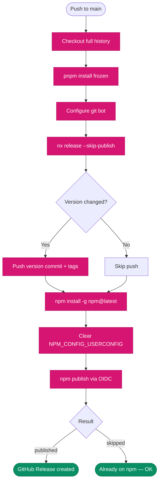

# Release Strategy

This monorepo uses **independent versioning with release groups** for automated, safe releases to npm via GitHub Actions and OIDC trusted publishing (no long-lived tokens).

---

## Overview

```
Push to main → nx release (version + changelog + tag) → npm publish (OIDC)
```

No manual version bumps. Versions are determined automatically from **conventional commits** since the last git tag per package.

---

## Commit Type → Version Bump

| Commit                                          | Bump               | Example                    |
| ----------------------------------------------- | ------------------ | -------------------------- |
| `fix(core): correct tax calculation`            | **patch** `x.x.+1` | Bug fixes, refactors, perf |
| `feat(ng-components): add date-range-input`     | **minor** `x.+1.0` | New features, new exports  |
| `feat(core)!: remove deprecated SpResponse`     | **major** `+1.0.0` | Breaking API change        |
| `BREAKING CHANGE:` in commit body               | **major**          | Breaking API change        |
| `docs`, `chore`, `ci`, `test`, `build`, `style` | **none**           | No publish triggered       |

> Commit types are enforced by Husky `commit-msg` hook. Format: `<type>(<scope>): <description>` — max 72 chars, no emoji.

---

## Release Groups

Packages are organized in `nx.json` into three groups based on their coupling:

### Foundation

Stable, rarely changed — no internal dependencies.

| Package             | Internal deps |
| ------------------- | ------------- |
| `@acontplus/utils`  | None          |
| `@acontplus/ui-kit` | None          |

### Angular Libs

Tightly coupled with cascading peer dependencies.

| Package                        | Depends on                                               |
| ------------------------------ | -------------------------------------------------------- |
| `@acontplus/core`              | `utils`                                                  |
| `@acontplus/ng-config`         | `core`                                                   |
| `@acontplus/ng-notifications`  | `ui-kit`                                                 |
| `@acontplus/ng-components`     | `ui-kit`                                                 |
| `@acontplus/ng-infrastructure` | `core`, `ng-config`, `ng-notifications`, `ng-components` |
| `@acontplus/ng-auth`           | `core`, `ng-config`, `ng-infrastructure`, `ui-kit`       |

### Standalone

Independent — no internal peer dependencies.

| Package                  | Internal deps |
| ------------------------ | ------------- |
| `@acontplus/ng-common`   | None          |
| `@acontplus/ng-customer` | None          |

---

## Dependency Cascade (`updateDependents: auto`)

When a package bumps, Nx automatically updates peer dependency ranges in dependent packages and gives them a patch bump:

```
fix(core): correct validation logic
  → core 1.1.4 → 1.1.5  (patch — the fix)
  → ng-config 2.0.3 → 2.0.4  (peer dep "@acontplus/core" updated)
  → ng-infrastructure 2.0.16 → 2.0.17  (transitive)
  → ng-auth 2.1.15 → 2.1.16  (transitive)
  — utils, ui-kit, ng-common, ng-customer: unchanged
```

---

## Publishing — OIDC Trusted Publishers

Publishing uses **npm trusted publishers** instead of long-lived `NPM_TOKEN` secrets:

- No `NPM_TOKEN` stored in GitHub — authentication via OIDC short-lived tokens
- Provenance attestations generated automatically
- Credentials scoped to the exact workflow run, expire in minutes

### Requirements

- Node.js 24 (npm ≥ 11.5.1 required for OIDC)
- `id-token: write` permission in the workflow
- GitHub environment: `npm-publish`
- Each package configured on npmjs.com with trusted publisher settings

### npmjs.com Configuration (per package)

Go to **npmjs.com → Package Settings → Trusted Publisher**:

| Field             | Value            |
| ----------------- | ---------------- |
| Provider          | GitHub Actions   |
| Organization/user | `acontplus`      |
| Repository        | `acontplus-libs` |
| Workflow filename | `release.yml`    |
| Environment       | `npm-publish`    |

---

## Workflow Pipeline

The release workflow (`.github/workflows/release.yml`) runs on every push to `main`:



---

## Examples

### Scenario 1 — Bug fix in core

```bash
# Commit
fix(core): correct tax calculation rounding

# Result
core:               1.1.4 → 1.1.5  (patch)
ng-config:          2.0.3 → 2.0.4  (peer dep updated)
ng-infrastructure:  2.0.16 → 2.0.17  (transitive)
ng-auth:            2.1.15 → 2.1.16  (transitive)
# utils, ui-kit, ng-common, ng-customer: unchanged
```

### Scenario 2 — New feature in ng-common

```bash
# Commit
feat(ng-common): add date formatting pipe

# Result
ng-common: 1.0.12 → 1.1.0  (minor)
# All other packages: unchanged (standalone, no dependents)
```

### Scenario 3 — Breaking change in ui-kit

```bash
# Commit
feat(ui-kit)!: redesign notification icon constants

# Result
ui-kit:             1.0.2 → 2.0.0  (major)
ng-notifications:   2.1.0 → 2.1.1  (peer dep updated)
ng-components:      2.1.30 → 2.1.31  (peer dep updated)
ng-infrastructure:  2.0.16 → 2.0.17  (transitive)
ng-auth:            2.1.15 → 2.1.16  (transitive)
```

### Scenario 4 — No release

```bash
# Commit
docs(ng-auth): update README examples

# Result: no version bumps, no publish
```

---

## Tag Pattern

Each package uses its own git tags for version tracking:

```
{projectName}@{version}
```

Examples: `core@1.1.5`, `ng-auth@2.1.16`, `utils@1.1.1`

Nx compares commits between these tags to determine what changed per package.
